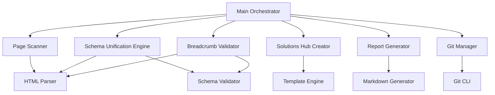

# Design Document: Schema and Breadcrumb Unification System

## Overview

This design document describes a script-based system for unifying and cleaning structured data (Schema.org JSON-LD and Breadcrumb) across the BrightAI website. The system addresses the current problem of duplicate and inconsistent Schema markup that creates confusing SEO signals for search engines.

### Problem Statement

The BrightAI website currently contains:
- Multiple JSON-LD blocks per page with duplicate Schema types (WebPage, BreadcrumbList, FAQPage, Organization)
- Inconsistent breadcrumb paths in solution pages (referencing "الخدمات" instead of "الحلول")
- Missing Solutions Hub page at `/solutions/`
- Misalignment between visual breadcrumbs and BreadcrumbList JSON-LD

### Solution Approach

The system will:
1. Scan all HTML files in specified paths
2. Parse and extract all JSON-LD blocks
3. Merge duplicate Schema entities into a single `@graph` structure
4. Correct breadcrumb paths for solution pages
5. Create Solutions Hub page if missing
6. Validate final structure against Schema.org specifications
7. Generate comprehensive cleanup report
8. Commit all changes to Git

### Technology Stack

- **Language**: Node.js (JavaScript/TypeScript) or Python
- **HTML Parsing**: cheerio (Node.js) or BeautifulSoup (Python)
- **JSON Validation**: ajv (Node.js) or jsonschema (Python)
- **File System**: Node.js fs module or Python pathlib
- **Git Integration**: simple-git (Node.js) or GitPython (Python)

### Design Principles

1. **Safety First**: Preserve all existing metadata (meta tags, Open Graph, Twitter Cards)
2. **Idempotency**: Running the script multiple times produces the same result
3. **Validation**: Validate all Schema structures before writing
4. **Traceability**: Generate detailed reports of all changes
5. **Modularity**: Separate concerns into distinct components

## Architecture

### System Components



### Component Responsibilities

#### 1. Main Orchestrator
- Coordinates execution flow across all components
- Manages error handling and rollback
- Ensures atomic operations (all-or-nothing)

#### 2. Page Scanner
- Discovers all HTML files in specified paths
- Identifies pages with multiple JSON-LD blocks
- Extracts Schema types from each block
- Flags pages with duplicate Schema

#### 3. Schema Unification Engine
- Parses all JSON-LD blocks in a page
- Merges entities into single `@graph` structure
- Removes duplicate Schema types
- Maintains proper `@id` references
- Determines appropriate Schema types per page

#### 4. Breadcrumb Validator
- Validates breadcrumb structure in solution pages
- Corrects breadcrumb paths (الخدمات → الحلول)
- Ensures visual breadcrumb matches JSON-LD
- Validates sequential position values

#### 5. Solutions Hub Creator
- Checks if `/solutions/index.html` exists
- Creates page with proper structure if missing
- Generates navigation links to all solutions
- Adds unified Schema with correct breadcrumb

#### 6. Report Generator
- Documents all changes made
- Lists pages with duplicate Schema
- Shows before/after examples
- Provides summary statistics

#### 7. Git Manager
- Stages modified files
- Creates commit with descriptive message
- Handles commit errors gracefully

## Components and Interfaces

### 1. Page Scanner

```typescript
interface PageScanResult {
  path: string;
  jsonLdBlocks: JSONLDBlock[];
  duplicateTypes: SchemaType[];
  visualBreadcrumb: BreadcrumbElement[];
  hasFAQContent: boolean;
}

interface JSONLDBlock {
  content: object;
  schemaTypes: SchemaType[];
  position: number; // position in HTML
}

class PageScanner {
  scanPaths(paths: string[]): PageScanResult[];
  identifyDuplicates(result: PageScanResult): SchemaType[];
  extractVisualBreadcrumb(html: string): BreadcrumbElement[];
  detectFAQContent(html: string): boolean;
}
```

### 2. Schema Unification Engine

```typescript
interface UnifiedSchema {
  "@context": "https://schema.org";
  "@graph": SchemaEntity[];
}

interface SchemaEntity {
  "@type": string | string[];
  "@id": string;
  [key: string]: any;
}

class SchemaUnificationEngine {
  unifySchemas(blocks: JSONLDBlock[]): UnifiedSchema;
  mergeEntities(entities: SchemaEntity[]): SchemaEntity[];
  removeDuplicates(entities: SchemaEntity[]): SchemaEntity[];
  determineSchemaTypes(page: PageScanResult): SchemaType[];
  validateReferences(graph: SchemaEntity[]): boolean;
}
```

### 3. Breadcrumb Validator

```typescript
interface BreadcrumbItem {
  "@type": "ListItem";
  position: number;
  name: string;
  item: string;
}

interface BreadcrumbList {
  "@type": "BreadcrumbList";
  "@id": string;
  itemListElement: BreadcrumbItem[];
}

class BreadcrumbValidator {
  validateSolutionBreadcrumb(path: string, breadcrumb: BreadcrumbList): ValidationResult;
  correctBreadcrumbPath(breadcrumb: BreadcrumbList): BreadcrumbList;
  ensureVisualMatch(html: string, breadcrumb: BreadcrumbList): string;
  validateSequentialPositions(items: BreadcrumbItem[]): boolean;
}
```

### 4. Solutions Hub Creator

```typescript
interface SolutionLink {
  name: string;
  path: string;
  description: string;
}

class SolutionsHubCreator {
  checkExists(): boolean;
  createHub(solutions: SolutionLink[]): string;
  generateSchema(): UnifiedSchema;
  generateHTML(solutions: SolutionLink[]): string;
}
```

### 5. Report Generator

```typescript
interface CleanupReport {
  summary: ReportSummary;
  pagesScanned: string[];
  pagesModified: PageModification[];
  pagesRequiringReview: string[];
  beforeAfterExamples: BeforeAfter[];
  solutionsHubCreated: boolean;
}

interface PageModification {
  path: string;
  duplicatesRemoved: SchemaType[];
  breadcrumbCorrected: boolean;
  schemaUnified: boolean;
}

class ReportGenerator {
  generateReport(results: ProcessingResult[]): CleanupReport;
  formatMarkdown(report: CleanupReport): string;
  saveReport(path: string, content: string): void;
}
```

### 6. Git Manager

```typescript
class GitManager {
  stageFiles(paths: string[]): void;
  createCommit(message: string): CommitResult;
  validateRepository(): boolean;
}
```

## Data Models

### Schema Type Enumeration

```typescript
enum SchemaType {
  Organization = "Organization",
  LocalBusiness = "LocalBusiness",
  WebSite = "WebSite",
  WebPage = "WebPage",
  BreadcrumbList = "BreadcrumbList",
  FAQPage = "FAQPage",
  Article = "Article",
  BlogPosting = "BlogPosting",
  SoftwareApplication = "SoftwareApplication"
}
```

### Page Type Classification

```typescript
enum PageType {
  Homepage = "homepage",
  SolutionPage = "solution",
  SolutionsHub = "solutions-hub",
  ServicePage = "service",
  DocumentationPage = "documentation",
  LegalPage = "legal",
  ContactPage = "contact"
}
```

### Unified Schema Structure

All pages will follow this structure:

```json
{
  "@context": "https://schema.org",
  "@graph": [
    {
      "@type": ["Organization", "LocalBusiness"],
      "@id": "https://brightai.site/#organization",
      "name": "BrightAI",
      "url": "https://brightai.site/",
      "logo": "https://brightai.site/frontend/images/logo-new.PNG",
      "areaServed": "SA"
    },
    {
      "@type": "WebSite",
      "@id": "https://brightai.site/#website",
      "url": "https://brightai.site",
      "name": "BrightAI",
      "publisher": { "@id": "https://brightai.site/#organization" },
      "inLanguage": ["ar-SA"]
    },
    {
      "@type": "WebPage",
      "@id": "https://brightai.site/[path]/#webpage",
      "url": "https://brightai.site/[path]/",
      "name": "[Page Title]",
      "description": "[Page Description]",
      "inLanguage": "ar-SA",
      "isPartOf": { "@id": "https://brightai.site/#website" },
      "about": { "@id": "https://brightai.site/#organization" }
    },
    {
      "@type": "BreadcrumbList",
      "@id": "https://brightai.site/[path]/#breadcrumb",
      "itemListElement": [...]
    }
  ]
}
```

### Breadcrumb Structure for Solution Pages

```json
{
  "@type": "BreadcrumbList",
  "@id": "https://brightai.site/solutions/[solution-name]/#breadcrumb",
  "itemListElement": [
    {
      "@type": "ListItem",
      "position": 1,
      "name": "الرئيسية",
      "item": "https://brightai.site/"
    },
    {
      "@type": "ListItem",
      "position": 2,
      "name": "الحلول",
      "item": "https://brightai.site/solutions/"
    },
    {
      "@type": "ListItem",
      "position": 3,
      "name": "[Solution Name]",
      "item": "https://brightai.site/solutions/[solution-name]/"
    }
  ]
}
```

## Error Handling

### Error Categories

1. **File System Errors**
   - File not found
   - Permission denied
   - Disk full

2. **Parsing Errors**
   - Invalid HTML structure
   - Malformed JSON-LD
   - Missing required elements

3. **Validation Errors**
   - Invalid Schema structure
   - Missing required properties
   - Invalid @id references

4. **Git Errors**
   - Not a git repository
   - Uncommitted changes
   - Commit failure

### Error Handling Strategy

```typescript
class ErrorHandler {
  handleFileSystemError(error: Error, path: string): void;
  handleParsingError(error: Error, content: string): void;
  handleValidationError(error: ValidationError, schema: object): void;
  handleGitError(error: Error): void;
  
  // Rollback mechanism
  rollback(changes: FileChange[]): void;
}
```

### Validation Rules

1. **JSON-LD Validation**
   - Valid JSON syntax
   - Required properties present
   - Valid @type values
   - Valid @id format (URL)

2. **Breadcrumb Validation**
   - Sequential position values (1, 2, 3, ...)
   - All items have "name" and "item"
   - Valid URL format for "item"
   - Correct path hierarchy

3. **Schema Type Validation**
   - Organization: name, url, logo required
   - WebPage: name, description, url required
   - BreadcrumbList: itemListElement required
   - FAQPage: mainEntity required (only if FAQ content exists)

## Testing Strategy

This feature involves HTML parsing, JSON manipulation, and file system operations. Property-based testing is **NOT appropriate** for this feature because:

1. **Infrastructure as Code**: This is a one-time data migration/cleanup script, not a reusable function with varying inputs
2. **File System Operations**: Testing involves actual file I/O and Git operations
3. **HTML Parsing**: Behavior is deterministic based on specific HTML structure
4. **Configuration Validation**: Checking that Schema is correctly structured

### Testing Approach

**Unit Tests** (Example-based):
- Test HTML parsing with specific examples
- Test JSON-LD merging with known duplicate cases
- Test breadcrumb correction with specific paths
- Test Schema validation with valid/invalid examples
- Test report generation with sample data

**Integration Tests**:
- Test full workflow on sample HTML files
- Test Git operations in test repository
- Test file system operations in temporary directory
- Test error handling and rollback

**Manual Testing**:
- Run script on staging copy of website
- Validate output in Google Rich Results Test
- Validate output in Schema.org validator
- Review generated report for accuracy

### Test Cases

#### Unit Test Examples

1. **Schema Merging**
   - Input: Two JSON-LD blocks with duplicate WebPage
   - Expected: Single @graph with one WebPage entity

2. **Breadcrumb Correction**
   - Input: Breadcrumb with "الخدمات" at position 2
   - Expected: Breadcrumb with "الحلول" at position 2

3. **FAQ Detection**
   - Input: HTML with `<details>` elements containing questions
   - Expected: `hasFAQContent = true`

4. **Schema Validation**
   - Input: BreadcrumbList with non-sequential positions [1, 3, 4]
   - Expected: Validation error

#### Integration Test Examples

1. **Full Workflow**
   - Setup: Create test HTML files with duplicate Schema
   - Execute: Run unification script
   - Verify: Check unified Schema structure
   - Verify: Check generated report
   - Cleanup: Remove test files

2. **Solutions Hub Creation**
   - Setup: Remove `/solutions/index.html` if exists
   - Execute: Run script
   - Verify: File created with correct structure
   - Verify: Schema includes correct breadcrumb

3. **Git Integration**
   - Setup: Initialize test git repository
   - Execute: Run script with commit option
   - Verify: Commit created with correct message
   - Verify: All modified files included

### Test Data

Create sample HTML files representing:
- Homepage with multiple JSON-LD blocks
- Solution page with incorrect breadcrumb
- Page with FAQ content
- Page without FAQ content
- Page with malformed JSON-LD

## Implementation Plan

### Phase 1: Core Infrastructure (Week 1)

1. Set up project structure
2. Implement HTML parser wrapper
3. Implement JSON-LD extractor
4. Implement Schema validator
5. Write unit tests for core functions

### Phase 2: Unification Logic (Week 1-2)

1. Implement Schema merger
2. Implement duplicate remover
3. Implement @graph builder
4. Implement Schema type determiner
5. Write unit tests for unification

### Phase 3: Breadcrumb Correction (Week 2)

1. Implement breadcrumb parser
2. Implement breadcrumb corrector
3. Implement visual breadcrumb updater
4. Write unit tests for breadcrumb logic

### Phase 4: Solutions Hub (Week 2)

1. Implement hub existence checker
2. Implement HTML template generator
3. Implement Schema generator for hub
4. Write unit tests for hub creation

### Phase 5: Integration (Week 3)

1. Implement main orchestrator
2. Implement report generator
3. Implement Git manager
4. Write integration tests
5. Test on staging environment

### Phase 6: Deployment (Week 3)

1. Run on production copy
2. Review generated report
3. Validate with Google tools
4. Create Git commit
5. Deploy changes

## Deployment Strategy

### Pre-Deployment Checklist

- [ ] All unit tests passing
- [ ] All integration tests passing
- [ ] Script tested on staging copy
- [ ] Report reviewed and approved
- [ ] Backup of current HTML files created
- [ ] Git repository clean (no uncommitted changes)

### Deployment Steps

1. **Backup Current State**
   ```bash
   git checkout -b backup-before-schema-cleanup
   git push origin backup-before-schema-cleanup
   ```

2. **Run Script**
   ```bash
   node scripts/unify-schema.js --dry-run
   # Review output
   node scripts/unify-schema.js --execute
   ```

3. **Review Changes**
   ```bash
   git diff
   cat reports/seo/schema-breadcrumb-cleanup-report.md
   ```

4. **Validate Output**
   - Test sample pages in Google Rich Results Test
   - Test sample pages in Schema.org validator
   - Verify visual breadcrumbs display correctly

5. **Commit and Push**
   ```bash
   git add .
   git commit -m "Unify structured data and solution breadcrumbs"
   git push origin main
   ```

6. **Post-Deployment Validation**
   - Monitor Google Search Console for errors
   - Check structured data reports
   - Verify no increase in crawl errors

### Rollback Plan

If issues are detected:

1. **Immediate Rollback**
   ```bash
   git revert HEAD
   git push origin main
   ```

2. **Restore from Backup**
   ```bash
   git checkout backup-before-schema-cleanup
   git checkout -b main-restored
   git push origin main-restored --force
   ```

## Monitoring and Validation

### Post-Deployment Monitoring

1. **Google Search Console**
   - Monitor structured data errors
   - Check for new warnings
   - Verify breadcrumb display

2. **Schema Validators**
   - Google Rich Results Test
   - Schema.org Validator
   - Bing Webmaster Tools

3. **Manual Checks**
   - Verify visual breadcrumbs
   - Check page titles and descriptions
   - Verify canonical URLs unchanged

### Success Metrics

- Zero duplicate Schema types per page
- All solution pages have correct breadcrumb path
- Solutions Hub page created and indexed
- No increase in structured data errors
- All pages pass Schema.org validation

## Future Enhancements

1. **Automated Monitoring**
   - CI/CD integration to validate Schema on every commit
   - Automated tests for Schema structure

2. **Schema Enhancement**
   - Add more specific Schema types (e.g., SoftwareApplication for product pages)
   - Add review/rating Schema where appropriate
   - Add video Schema for pages with video content

3. **Breadcrumb Enhancement**
   - Add breadcrumb to more page types
   - Implement dynamic breadcrumb generation

4. **Reporting Enhancement**
   - Generate HTML report with visual diffs
   - Add Schema coverage metrics
   - Track Schema health over time

## Appendix

### Solution Pages List

The following solution pages need breadcrumb correction:

1. `/solutions/ai-governance-platform/`
2. `/solutions/ai-firewall/`
3. `/solutions/ai-audit-trail/`
4. `/solutions/human-approval-layer/`
5. `/solutions/ai-evidence-file/`
6. `/solutions/continuous-ai-governance/`
7. `/solutions/ai-risk-classification/`
8. `/solutions/ai-use-case-discovery/`
9. `/solutions/policy-to-control-mapping/`

### HTML Paths to Scan

```
index.html
docs/index.html
docs/**/*.html
solutions/**/*.html
services/index.html
contact/index.html
pricing/index.html
privacy-policy/index.html
terms/index.html
cookie-policy/index.html
data-processing-agreement/index.html
pdpl-statement/index.html
```

### Schema.org References

- [Schema.org Documentation](https://schema.org/)
- [BreadcrumbList](https://schema.org/BreadcrumbList)
- [WebPage](https://schema.org/WebPage)
- [Organization](https://schema.org/Organization)
- [FAQPage](https://schema.org/FAQPage)
- [Google Structured Data Guidelines](https://developers.google.com/search/docs/appearance/structured-data)

### Tools and Libraries

**Node.js Option:**
- cheerio: HTML parsing
- ajv: JSON Schema validation
- simple-git: Git operations
- glob: File pattern matching

**Python Option:**
- BeautifulSoup4: HTML parsing
- jsonschema: JSON validation
- GitPython: Git operations
- pathlib: File system operations

### Example Script Structure

```javascript
// scripts/unify-schema.js

const fs = require('fs');
const path = require('path');
const cheerio = require('cheerio');
const { glob } = require('glob');
const simpleGit = require('simple-git');

class SchemaUnifier {
  constructor(options = {}) {
    this.dryRun = options.dryRun || false;
    this.git = simpleGit();
    this.results = [];
  }

  async run() {
    console.log('Starting Schema unification...');
    
    // 1. Scan pages
    const pages = await this.scanPages();
    console.log(`Found ${pages.length} pages to process`);
    
    // 2. Process each page
    for (const page of pages) {
      const result = await this.processPage(page);
      this.results.push(result);
    }
    
    // 3. Create Solutions Hub if needed
    await this.createSolutionsHub();
    
    // 4. Generate report
    const report = this.generateReport();
    await this.saveReport(report);
    
    // 5. Commit changes
    if (!this.dryRun) {
      await this.commitChanges();
    }
    
    console.log('Schema unification complete!');
  }

  async scanPages() {
    const patterns = [
      'index.html',
      'docs/index.html',
      'docs/**/*.html',
      'solutions/**/*.html',
      'services/index.html',
      'contact/index.html',
      'pricing/index.html',
      'privacy-policy/index.html',
      'terms/index.html',
      'cookie-policy/index.html',
      'data-processing-agreement/index.html',
      'pdpl-statement/index.html'
    ];
    
    const files = [];
    for (const pattern of patterns) {
      const matches = await glob(pattern);
      files.push(...matches);
    }
    
    return files;
  }

  async processPage(pagePath) {
    // Implementation details...
  }

  async createSolutionsHub() {
    // Implementation details...
  }

  generateReport() {
    // Implementation details...
  }

  async saveReport(report) {
    // Implementation details...
  }

  async commitChanges() {
    // Implementation details...
  }
}

// CLI
const args = process.argv.slice(2);
const dryRun = args.includes('--dry-run');

const unifier = new SchemaUnifier({ dryRun });
unifier.run().catch(console.error);
```
